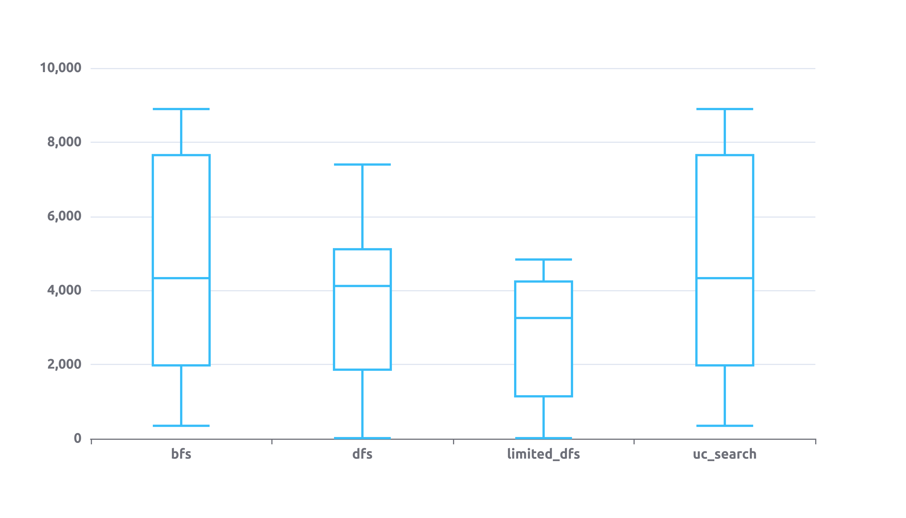
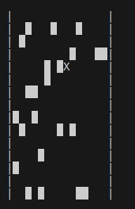
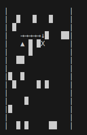
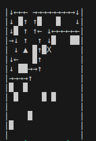

# Búsquedas no informadas

## B. Ejecutar un total de 30 veces y presentar los resultados en un gráfico de cajas y bigotes o boxplots.
Los agentes fueron ejecutados 30 veces en entornos de 100x100 con 10% de obstáculos. Se utilizó el algoritmo de búsqueda en profundidad con límite de profundidad 5000. Se graficaron los resultados en un boxplot donde el eje y es la cantidad de pasos realizados, en el caso de los agentes dfs_limited no se consideró aquellos agentes que no encontraron la solución (8 agentes fallaron).

### Gráficos de los agentes en entornos de 15x15
Start position: (4,3)
End position: (4,8)

- Enviroment  

- Bfs Path  

- Dfs Path  

## C. ¿Cuál de los 3 algoritmos considera más adecuado para resolver el problema planteado en A?
Si bien es cierto que los algoritmos BFS encuentra el camino más corto posible, si nos interesa optimizar la cantidad de pasos realizados por el agente, el algoritmo DFS es el más adecuado. Esto se debe a que el algoritmo BFS explora todos los nodos de un nivel antes de pasar al siguiente, mientras que el algoritmo DFS explora un camino hasta que no puede seguir avanzando, y luego vuelve al nodo anterior y explora otro camino.
