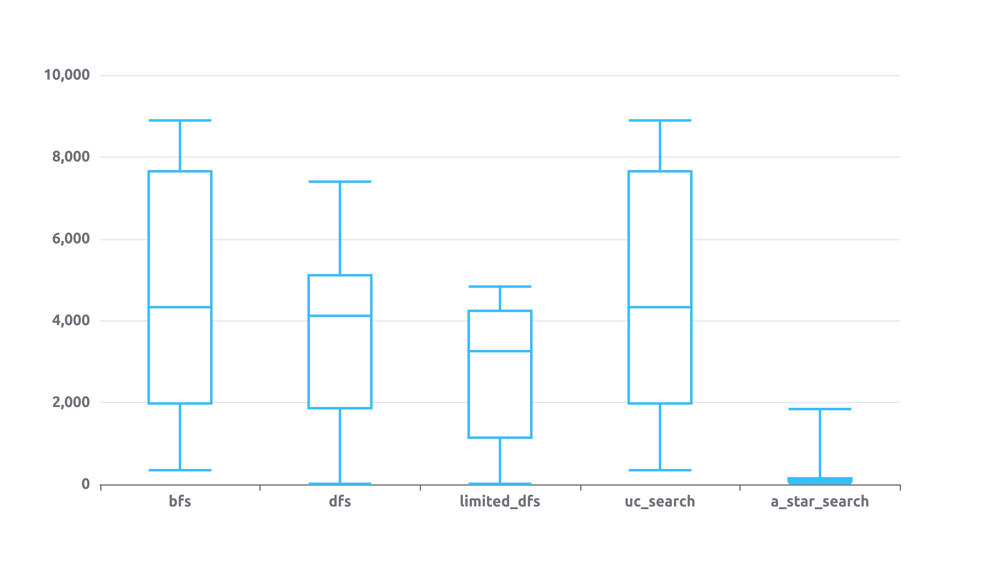

# Búsquedas Informada

##  Evaluar cada uno de los algoritmos sobre el mismo escenario aleatorio con una tasa de obstáculos del 8 por ciento.  Presentar los resultados en un gráfico de cajas y bigotes o boxplots. Incluya también los resultados obtenidos en el punto B del TP3 sobre búsquedas no informadas.

Los agentes fueron ejecutados 30 veces en entornos de 100x100 con 8% de obstáculos. Se utilizó el algoritmo de búsqueda en profundidad con límite de profundidad 5000. Se graficaron los resultados en un boxplot donde el eje y es la cantidad de pasos realizados, en el caso de los agentes dfs_limited no se consideró aquellos agentes que no encontraron la solución (8 agentes fallaron).

