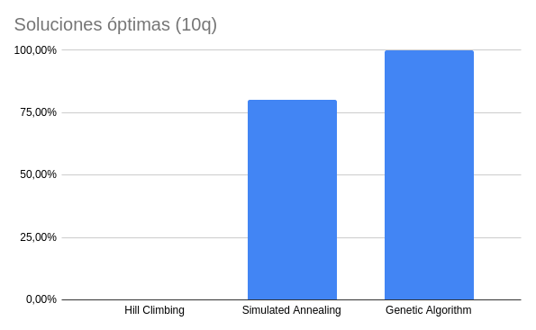

# TP 5 - Búsquedas locales

## Ejecutar cada uno de los algoritmos 30 veces y obtener:

### 4 Reinas

- Porcentajes de soluciones optimas

- Tiempo de ejecución

- Cantidad de pasos

### 8 Reinas

- Porcentajes de soluciones optimas

- Tiempo de ejecución

- Cantidad de pasos

### 10 Reinas

- Porcentajes de soluciones optimas

- Tiempo de ejecución

- Cantidad de pasos

## Graficar la variación  de la función h() a lo largo de las iteraciones

### Hill Climbing

### Simulated Annealing

### Genetic Algorithm

## Cuál de los tres algoritmos implementados resulta más adecuado para la solución del problema de las n-reinas

Si bien es cierto que el algoritmo genético resuelve el problema en una cantida mucho menor de pasos, cada paso demora mucho más tiempo que los otros dos algoritmos. Por lo tanto no es el más adecuado. El algoritmo de Hill Climbing es el que menos pasos y tiempo requiere para resolver el problema, pero no siempre encuentra la solución óptima. 

El algoritmo de Simulated Annealing es el que más pasos requiere para resolver el problema, pero siempre encuentra la solución óptima. Además, el tiempo que requiere es menor que el algoritmo genético. Por lo tanto, en mi opinión es el más adecuado para resolver el problema de las n-reinas.