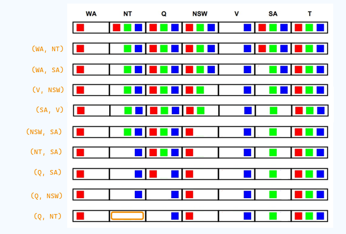

# TP 6 - CSP

## Describir en detalle una formulación CSP para el Sudoku.

El Sudoku es un juego de lógica en el que se debe completar una grilla de 9x9 casilleros con números del 1 al 9, de manera que no se repitan números en una misma fila, columna o subgrilla de 3x3 casilleros. El objetivo del juego es completar la grilla de manera que se cumplan las reglas anteriores.

- Variables: $V =  \{C_{(1,1)}, C_{(1,2)}, \dots, C_{(1,9)}, C_{(2,1)}, \dots, C_{(9,9)}\}$

- Dominio: $D = \{1, 2, \dots, 9\}$

- Restricciones:

    - Dos casillas ubicadas en la misma fila no pueden tener el mismo valor:

        $R_1 = \{C_{(i,j)} \neq C_{(i,k)} \mid j \neq k\}$

    - Dos casillas ubicadas en la misma columna no pueden tener el mismo valor:

        $R_2 = \{C_{(i,j)} \neq C_{(k,j)} \mid i \neq k\}$

    - Dos casillas ubicadas en la misma cuadricula de 3x3 no pueden tener el mismo valor:

        $R_3 = \{C_{(i,j)} \neq C_{(k,l)} \mid  
        \lfloor{{i}\div{3}}\rfloor \neq \lfloor{{k}\div{3}}\rfloor \land 
        \lfloor{{j}\div{3}}\rfloor \neq \lfloor{{l}\div{3}}\rfloor \}$ 

## Utilizar el algoritmo AC-3 para demostrar que la arco consistencia puede detectar la inconsistencia de la asignación parcial {WA=red, V=blue} para el problema del colorar el mapa de Australia

En la siguiente imagen se muestra como se va reduciendo el dominio de las variables a medida que se van aplicando las restricciones de los arcos (ubicado a la izquierda en naranja) hasta que NT no tiene más valores posibles, demostrando la inconsistencia.

