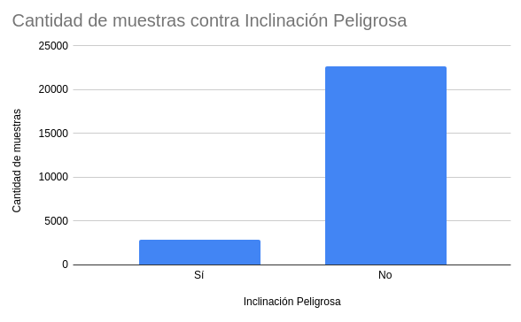
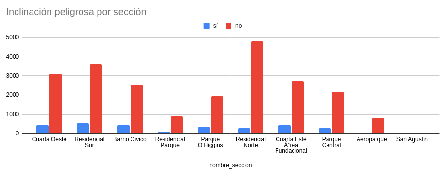
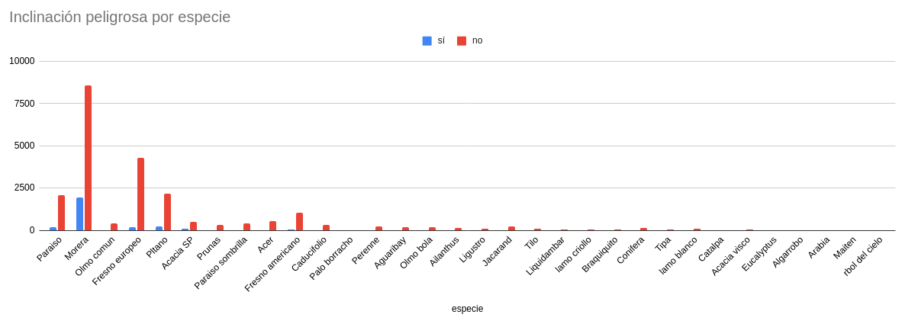
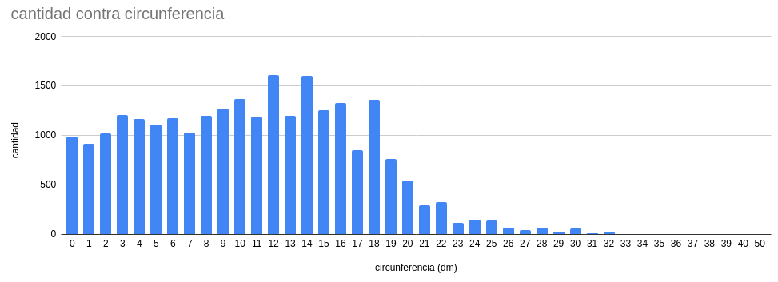
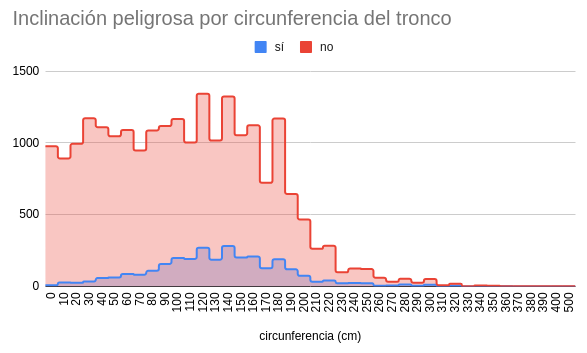

# TP 7 - Machine Learining - EDA

## ¿Cual es la distribución de las clase inclinacion_peligrosa?
La distribución de la clase inclinacion_peligrosa es la siguiente:
- No: 22640
- Sí: 2889



## ¿Se puede considerar alguna sección más peligrosa que otra?

Las secciones Cuarta Oeste, Residencial Norte y Residencial Sur son más peligrosa que el resto.



## ¿Se puede considerar alguna especie más peligrosa que otra?


## Generar un histograma de frecuencia para la variable circ_tronco_cm.



## Repetir el punto anterior pero separando por la clase de la variable inclinación_peligrosa



## Crear una nueva variable categórica de nombre circ_tronco_cm_cat a partir circ_tronco_cm, en donde puedan asignarse solo  4 posibles valores [ muy alto, alto, medio, bajo ]

```r
discrete_circ <- function(value){
  if (value < 80){
    return("bajo")
  }
  else if (value < 190){
    return("medio")
  }
  else if (value < 250){
    return("alto")
  }
  else {
    return("muy alto")
  }
}

dataframe <- dataframe %>% dplyr::mutate(circ_tronco_cm_discrete = sapply(circ_tronco_cm, discrete_circ))
```